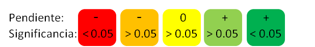

---
params:
    title: ""
    peces: ""
    invertebrados: ""
    pesca: ""
    gov: ""
    coop: ""
    comunidad: ""
    reserva: ""
    control: ""
output: 
    html_document: 
        fig_caption: yes
        toc: yes
        toc_float:
            collapsed: no
            smooth_scroll: no
---

---
title: `r params$title`
---

```{r setup, include=FALSE}
knitr::opts_chunk$set(echo = F, fig.height = 3, warning = F, message = F, results = 'asis')
```

```{r cargar paquetes}

suppressPackageStartupMessages({
  library(ggplot2)
  library(dplyr)
  library(tidyr)
  library(MPAtools)
  library(reshape)
  library(stargazer)
  library(ggExtra)
})

```

<style type="text/css">
.table {

width: 80%;

}
</style>

*Este documento fue generado por el paquete [`MPAtools`](https://github.com/turfeffect/MPAtools), uno de los entregables del grupo [TURFeffect](www.turfeffect.org). Los resultados presentados son una version preliminar del software que se esta desarrollando, y no recomendamos la toma de decisiones basado en la informacion aqui presentada*

*Acentos y caracteres especiales omitidos*

# Resumen

<center>

**Leyenda**

----



----

</center>

```{r}

peces = params$peces
invertebrados = params$invertebrados
pesca = params$pesca
comunidad = params$comunidad
reserva = params$reserva
control = params$control

Dp <- summary(turfeffect(density(peces, comunidad), reserva, control))
Sp <- summary(turfeffect(richness(peces, comunidad), reserva, control))
Bp <- summary(turfeffect(fish_biomass(peces, comunidad), reserva, control))
NT <- summary(turfeffect(trophic(peces, comunidad), reserva, control))

Di <- summary(turfeffect(density(invertebrados, comunidad), reserva, control))

lang <- filter(invertebrados, GeneroEspecie == "Panulirus argus")
Nlang <- summary(turfeffect(density(lang, comunidad), reserva, control))

car <- filter(invertebrados, GeneroEspecie == "Strombus gigas")
Ncar <- summary(turfeffect(density(car, comunidad), reserva, control))

lut <- filter(peces, Genero == "Lutjanus")
Nlut <- summary(turfeffect(density(lut, comunidad), reserva, control))
Blut <- summary(turfeffect(fish_biomass(lut, comunidad), reserva, control))

## Landings section

arribos <- landings(data = pesca, site = coop, type = 'kg')

arrG <- arribos %>%
  group_by(Ano) %>%
  summarize(Peso = sum(Peso)/1000)

modG <- lm(Peso ~ Ano, arrG)

arrM <- arribos %>%
  filter(NombreCientifico == "Epinephelus spp") %>%
  mutate(Peso = Peso/1000)

modM <- lm(Peso ~ Ano, arrM)

arrP <- arribos %>%
  filter(NombreCientifico == "Lutjanus aratus" |
           NombreCientifico == "Lutjanus cyanopterus" |
           NombreCientifico == "Lujanus griseus" |
           NombreCientifico == "Lutjanus spp." |
           NombreCientifico == "Lutjanus viridis" |
           NombreCientifico == "Lutjanus spp") %>%
  mutate(Peso = Peso /1000)

modP <- lm(Peso ~ Ano, arrP)

arrL <- arribos %>%
  filter(NombreCientifico == "Panulirus argus") %>%
  mutate(Peso = Peso /1000)

modL <- lm(Peso ~ Ano, arrL)

# Landings and price

ingresos <- landings(data = pesca, site =coop, type = 'price')

ingG <- ingresos %>%
  group_by(Ano) %>%
  summarize(Valor = sum(Precio)/1000)

modG2 <- lm(Valor ~ Ano, ingG)

ingM <- ingresos %>%
  filter(NombreCientifico == "Epinephelus spp")

modM2 <- lm(Precio ~ Ano, ingM)

ingP <- ingresos %>%
  filter(NombreCientifico == "Lutjanus aratus" |
           NombreCientifico == "Lutjanus cyanopterus" |
           NombreCientifico == "Lujanus griseus" |
           NombreCientifico == "Lutjanus spp." |
           NombreCientifico == "Lutjanus viridis" |
           NombreCientifico == "Lutjanus spp") %>%
  mutate(Precio = Precio /1000)

modP2 <- lm(Precio ~ Ano, ingP)

ingL <- ingresos %>%
  filter(NombreCientifico == "Panulirus argus") %>%
  mutate(Precio = Precio /1000)

modL2 <- lm(Precio ~ Ano, ingL)

##

summary <- list(Bio = list(P = list(Dp = score(x = data.frame(est = coefficients(Dp)[4],
                                                              p = coefficients(Dp)[16])),
                                    
                                    Sp = score(x = data.frame(est = coefficients(Sp)[4],
                                                              p = coefficients(Sp)[16])),
                                    
                                    Bp = score(x = data.frame(est = coefficients(Bp)[4],
                                                              p = coefficients(Bp)[16])),
                                    
                                    NT = score(x = data.frame(est = coefficients(NT)[4],
                                                              p = coefficients(NT)[16]))),
                           
                           I = list(Di = score(x = data.frame(est = coefficients(Di)[4],
                                                              p = coefficients(Di)[16]))),
                           
                           O = list(L = score(x = data.frame(est = coefficients(Nlang)[4],
                                                             p = coefficients(Nlang)[16])),
                                    
                                    C = score(x = data.frame(est = coefficients(Ncar)[4],
                                                             p = coefficients(Ncar)[16])),
                                    
                                    P = score(x = data.frame(est = coefficients(Nlut)[4],
                                                             p = coefficients(Nlut)[16])),
                                    
                                    Pb = score(x = data.frame(est = coefficients(Blut)[4],
                                                              p = coefficients(Blut)[16])))),
                
                Soc = list(L = list(Lg = score(x = data.frame(est = coefficients(summary(modG))[2],
                                                              p = coefficients(summary(modG))[8])),
                                    
                                    Lm = score(x = data.frame(est = coefficients(summary(modM))[2],
                                                              p = coefficients(summary(modM))[8])),
                                    
                                    Lp = score(x = data.frame(est = coefficients(summary(modL))[2],
                                                              p = coefficients(summary(modM))[8])),
                                    
                                    Ll = score(x = data.frame(est = coefficients(summary(modM))[2],
                                                              p = coefficients(summary(modM))[8]))),
                           V = list(Vg = score(x = data.frame(est = coefficients(summary(modG2))[2],
                                                              p = coefficients(summary(modG2))[8])),
                                    
                                    Vm = score(x = data.frame(est = coefficients(summary(modM2))[2],
                                                              p = coefficients(summary(modM2))[8])),
                                    
                                    Vp = score(x = data.frame(est = coefficients(summary(modL2))[2],
                                                              p = coefficients(summary(modM2))[8])),
                                    
                                    Vl = score(x = data.frame(est = coefficients(summary(modM2))[2],
                                                              p = coefficients(summary(modM2))[8])))),
                
                Gov = list(1))


```


Cat    | Indicador               | Valor                                        |Cat    | Indicador               | Valor                                        |
-------|-------------------------|----------------------------------------------|-------|-------------------------|----------------------------------------------|
Bio    | Densidad Peces          | `r knitr::include_graphics(summary$Bio$P$Dp)`| Soc   | Arribos totales         | `r knitr::include_graphics(summary$Soc$L$Lg)`
Bio    | Riqueza Peces           | `r knitr::include_graphics(summary$Bio$P$Sp)`| Soc   | Arribos de mero         | `r knitr::include_graphics(summary$Soc$L$Lm)`
Bio    | Biomasa Peces           | `r knitr::include_graphics(summary$Bio$P$Bp)`| Soc   | Arribos de pargos       | `r knitr::include_graphics(summary$Soc$L$Lp)`
Bio    | Nivel Trofico Peces     | `r knitr::include_graphics(summary$Bio$P$NT)`| Soc   | Arribos de langosta     | `r knitr::include_graphics(summary$Soc$L$Ll)`
Bio    | Densidad Iinvertebrados | `r knitr::include_graphics(summary$Bio$I$Di)`| Soc   | Ingresos totales        | `r knitr::include_graphics(summary$Soc$V$Vg)`
Bio    | Densidad de langostas   | `r knitr::include_graphics(summary$Bio$O$L)` | Soc   | Ingresos por mero       | `r knitr::include_graphics(summary$Soc$V$Vm)`
Bio    | Densidad de caracol rosa| `r knitr::include_graphics(summary$Bio$O$C)` | Soc   | Ingresos por pargos     | `r knitr::include_graphics(summary$Soc$V$Vp)`
Bio    | Densidad de pargos      | `r knitr::include_graphics(summary$Bio$O$P)` | Soc   | Ingresos por langosta   | `r knitr::include_graphics(summary$Soc$V$Vl)`
Bio    | Biomasa de pargos       | `r knitr::include_graphics(summary$Bio$O$Pb)`|       |                         |


<center>

# Ecologicos

## Peces

### Densidad

```{r densidad peces, fig.cap = "Densidad promedio de peces (org / m^2)."}

Np <- density(data = peces, location = comunidad)

mpa_plot3(Np, reserve = reserva, control = control, y.lab = "Densidad (org / m^2)")

```

```{r tabla densidad peces, results = 'asis'}

stargazer(turfeffect(Np, reserve = reserva, control = control), dep.var.labels = "Densidad (org / transecto)", type = "html", dep.var.caption = "", report = "vc*", single.row = T, omit.stat = c("adj.rsq", "n"), digits = 2, df = F, covariate.labels = c("Ano", "Zona", "**Ano:Zona**", "Constante"), notes = "+p < 0.1, ++p<0.05, +++p<0.001", notes.append = FALSE, star.char = "+")

```

### Riqueza

```{r riqueza peces, fig.cap = "Riqueza promedio de peces (Sp / transecto)."}

Sp <- richness(data = peces, location = comunidad)
mpa_plot3(Sp, reserve = reserva, control = control, y.lab = "Riqueza (Sp. / transecto)")
```

```{r tabla riqueza peces, results = 'asis'}

stargazer(turfeffect(Sp, reserve = reserva, control = control), dep.var.labels = "Riqueza (Sp. / transecto)", type = "html", dep.var.caption = "", report = "vc*", single.row = T, omit.stat = c("adj.rsq", "n"), digits = 2, df = F, covariate.labels = c("Ano", "Zona", "**Ano:Zona**", "Constante"), notes = "+p < 0.1, ++p<0.05, +++p<0.001", notes.append = FALSE, star.char = "+")

```

### Biomasa

```{r biomasa, fig.cap="Biomasa promedio de peces (Kg / transecto)."}

Bp <- fish_biomass(data = peces, location = comunidad)
mpa_plot3(Bp, reserve = reserva, control = control, y.lab = "Biomasa (Kg / transecto)")

```

```{r tabla de biomasa, results = 'asis'}

stargazer(turfeffect(Bp, reserve = reserva, control = control), dep.var.labels = "Biomasa (Kg / transecto)", type = "html", dep.var.caption = "", report = "vc*", single.row = T, omit.stat = c("adj.rsq", "n"), digits = 2, df = F, covariate.labels = c("Ano", "Zona", "**Ano:Zona**", "Constante"), notes = "+p < 0.1, ++p<0.05, +++p<0.001", notes.append = FALSE, star.char = "+")

```

### Nivel trofico

```{r nivel trofico, fig.cap = "Nivel trofico promedio de peces."}

NTp <- trophic(data = peces, location = comunidad)
mpa_plot3(NTp, reserve = reserva, control = control, y.lab = "Nivel trofico")

```

```{r tabla de nivel trofico, results = 'asis'}

stargazer(turfeffect(NTp, reserve = reserva, control = control), dep.var.labels = "Nivel trofico", type = "html", dep.var.caption = "", report = "vc*", single.row = T, omit.stat = c("adj.rsq", "n"), digits = 2, df = F, covariate.labels = c("Ano", "Zona", "**Ano:Zona**", "Constante"), notes = "+p < 0.1, ++p<0.05, +++p<0.001", notes.append = FALSE, star.char = "+")

```


## Invertebrados

### Densidades

```{r, densidad invertebrados, fig.cap = "Densidad promedio de invertebrados (org / transecto)."}

Ni <- density(data = invertebrados, location = comunidad) %>%
  filter(Sitio == reserva|
           Sitio == control)

mpa_plot3(Ni, reserve = reserva, control = control, y.lab = "Densidad (org / transecto)")

```

```{r tabla densidad invertebrados, results = 'asis'}

stargazer(turfeffect(Ni, reserve = reserva, control = control), dep.var.labels = "Densidad (org / transecto)", type = "html", dep.var.caption = "", report = "vc*", single.row = T, omit.stat = c("adj.rsq", "n"), digits = 2, df = F, covariate.labels = c("Ano", "Zona", "**Ano:Zona**", "Constante"), notes = "+p < 0.1, ++p<0.05, +++p<0.001", notes.append = FALSE, star.char = "+")

```


## Especies de interes

### Pargos (*Lutjanus sp.*)

#### Densidad

```{r densidad de pargos, fig.cap = "Densidad promedio de pargos (*Lutjanus sp.; org / transecto*)"}

lutjanus <- peces %>%
  filter(Genero == "Lutjanus")

Nlut <- density(lutjanus, location = comunidad)

mpa_plot3(Nlut, reserve = reserva, control = control, y.lab = "Densidad de pargos (org / transecto)")

```

```{r, tabla densidad pargos, results = 'asis'}

stargazer(turfeffect(Nlut, reserve = reserva, control = control), dep.var.labels = "Densidad (org / transecto)", type = "html", dep.var.caption = "", report = "vc*", single.row = T, omit.stat = c("adj.rsq", "n"), digits = 2, df = F, covariate.labels = c("Ano", "Zona", "**Ano:Zona**", "Constante"), notes = "+p < 0.1, ++p<0.05, +++p<0.001", notes.append = FALSE, star.char = "+")

```


#### Biomasa

```{r biomasa de pargos, fig.cap = "Densidad promedio de pargos (*Lutjanus sp.; Kg / transecto*)"}

Blut <- fish_biomass(lutjanus, location = comunidad)

mpa_plot3(Blut, reserve = reserva, control = control, y.lab = "Biomasa de pargos (Kg / transecto)")

```

```{r tabla biomasa pargos, results = 'asis'}

stargazer(turfeffect(Blut, reserve = reserva, control = control), dep.var.labels = "Biomasa (Kg / transecto)", type = "html", dep.var.caption = "", report = "vc*", single.row = T, omit.stat = c("adj.rsq", "n"), digits = 2, df = F, covariate.labels = c("Ano", "Zona", "**Ano:Zona**", "Constante"), notes = "+p < 0.1, ++p<0.05, +++p<0.001", notes.append = FALSE, star.char = "+")

```

### Langosta (*Panulirus argus*)

```{r, fig.cap = "Densidad promedio de langosta (*Panulirus argus*; org / transecto)."}

lang <- filter(invertebrados, GeneroEspecie == "Panulirus argus")

Nlang <- density(lang, location = comunidad)

mpa_plot3(Nlang, reserve = reserva, control = control, y.lab = "Densidad (langostas / transecto)")

```

```{r tabla densidad langosta, results = 'asis'}

stargazer(turfeffect(Nlang, reserve = reserva, control = control), dep.var.labels = "Densidad (org / transecto)", type = "html", dep.var.caption = "", report = "vc*", single.row = T, omit.stat = c("adj.rsq", "n"), digits = 2, df = F, covariate.labels = c("Ano", "Zona", "**Ano:Zona**", "Constante"), notes = "+p < 0.1, ++p<0.05, +++p<0.001", notes.append = FALSE, star.char = "+")

```

### Caracol rosa (*Lobatus gigas*)

```{r, fig.cap = "Densidad promedio de caracol rosa (*Lobatus gigas*; org / transecto)"}

car <- filter(invertebrados, GeneroEspecie == "Strombus gigas")

Ncar <- density(car, location = comunidad)

mpa_plot3(Ncar, reserve = reserva, control = control, y.lab = "Densidad (caracoles / transecto)")

```

```{r tabla densidad caracol, results = 'asis'}

stargazer(turfeffect(Ncar, reserve = reserva, control = control), dep.var.labels = "Densidad (org / transecto)", type = "html", dep.var.caption = "", report = "vc*", single.row = T, omit.stat = c("adj.rsq", "n"), digits = 2, df = F, covariate.labels = c("Ano", "Zona", "**Ano:Zona**", "Constante"), notes = "+p < 0.1, ++p<0.05, +++p<0.001", notes.append = FALSE, star.char = "+")

```


# Socioeconomico

## Capturas

```{r, include = F}

# Data and models for this section were calculated at the beggining of the document

```


### Generales


```{r}
ggplot(arrG, aes(x = Ano, y = Peso)) +
  geom_point() +
  geom_abline(intercept = coef(summary(modG))[1], slope = coef(summary(modG))[2]) +
  theme_bw() +
  labs(x = "Ano", y = "Capturas (T)")
```


### Especies Objetivo

#### Mero

```{r}
ggplot(arrM, aes(x = Ano, y = Peso)) +
  geom_point() +
  geom_abline(intercept = coef(summary(modM))[1], slope = coef(summary(modM))[2]) +
  theme_bw() +
  labs(x = "Ano", y = "Capturas (T)")
```

#### Pargo

```{r}
ggplot(arrP, aes(x = Ano, y = Peso)) +
  geom_point() +
  geom_abline(intercept = coef(summary(modP))[1], slope = coef(summary(modP))[2]) +
  theme_bw() +
  labs(x = "Ano", y = "Capturas (T)")
```

#### Langosta

```{r}
ggplot(arrL, aes(x = Ano, y = Peso)) +
  geom_point() +
  geom_abline(intercept = coef(summary(modL))[1], slope = coef(summary(modL))[2]) +
  theme_bw() +
  labs(x = "Ano", y = "Capturas (T)")
```

## Ingresos

```{r, include = F}

# Code for this section is at the begining of the document

```

### Generales

```{r}

ggplot(ingG, aes(x = Ano, y = Valor)) +
  geom_point()  +
  geom_abline(intercept = coef(summary(modG2))[1], slope = coef(summary(modG2))[2]) +
  theme_bw() +
  labs(x = "Ano", y = "Ingresos (Miles de pesos)")

```


### Especies Objetivo

#### Mero

```{r}
ggplot(ingM, aes(x = Ano, y = Precio)) +
  geom_point() +
  geom_abline(intercept = coef(summary(modM2))[1], slope = coef(summary(modM2))[2]) +
  theme_bw() +
  labs(x = "Ano", y = "Ingresos (Miles de pesos)")
```

#### Pargo

```{r}
ggplot(ingP, aes(x = Ano, y = Precio)) +
  geom_point() +
  geom_abline(intercept = coef(summary(modP2))[1], slope = coef(summary(modP2))[2]) +
  theme_bw() +
  labs(x = "Ano", y = "Ingresos (Miles de pesos)")
```

#### Langosta

```{r}
ggplot(ingL, aes(x = Ano, y = Precio)) +
  geom_point() +
  geom_abline(intercept = coef(summary(modL2))[1], slope = coef(summary(modL2))[2]) +
  theme_bw() +
  labs(x = "Ano", y = "Ingresos (Miles de pesos)")
```

## Indice de conocimiento


```{r}

#knowledge()

```


# Gobernanza

*La informacion de gobernanza se presenta con propositos de realizar el ejercicio; de ninguna manera representa una evaluacion que pueda utilizarse para recomendaciones.* 

## Acceso a la pesqueria

```{r}

gov$Access.to.the.fishery[2]

```


## Numero de pescadores

```{r}

gov$Number.of.fishers[1]

```


## Reconocimiento legal de la reserva

```{r}

gov$Legal.recognition.of.reserve[2]

```


## Tipo de reserva

```{r}

gov$Reserve.type[2]

```


## Grado de pesca ilegal

```{r}

gov$Illegal.harvesting[1]

gov$Illegal.harvesting[2]

```


## Plan de manejo

```{r}

gov$Management.plan[1]

gov$Management.plan[2]

```


## Procuracion de la reserva

```{r}

gov$Reserve.enforcement[2]

```


## Razonamiento para la ubicacion

```{r}

gov$Reasoning.for.reserve.location[2]

```


## Organizacion

```{r}

gov$Type.of.fisher.organizations[2]


```

## Nivel inclusividad
```{r}

gov$Representation[1]

gov$Representation[2]

```


</center>


_______

# Referencias

- R Core Team (2015). R: A language and environment for statistical computing. R Foundation for Statistical Computing, Vienna, Austria. URL https://www.R-project.org/.

- JJ Allaire, Joe Cheng, Yihui Xie, Jonathan McPherson, Winston Chang, Jeff Allen, Hadley Wickham, Aron Atkins and Rob Hyndman (2016). rmarkdown: Dynamic Documents for R. R package version 0.9.6. https://CRAN.R-project.org/package=rmarkdown

- Hadley Wickham and Romain Francois (2016). dplyr: A Grammar of Data Manipulation. R package version 0.5.0. https://CRAN.R-project.org/package=dplyr

- Hadley Wickham (2016). tidyr: Easily Tidy Data with `spread()` and `gather()` Functions. R package version 0.6.0. https://CRAN.R-project.org/package=tidyr

- Hlavac, Marek (2015). stargazer: Well-Formatted Regression and Summary Statistics Tables. R package version 5.2. http://CRAN.R-project.org/package=stargazer
